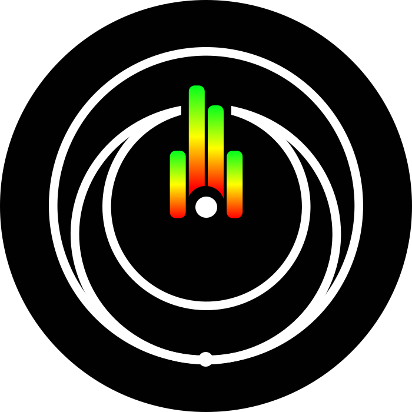

<h1 align="center">hey 👋 Felzow47</h1>

###

<h3 align="left">👨‍💻 À propos</h3>

  Autodidacte depuis une dizaine d'années. <b>Je touche à absolument tout, même hors programmation</b>, jusqu'à ce que ça tienne debout.  

###

<h3 align="left">🚀 Projets</h3>

  
  
  
  
  

###

<h3 align="left">🛠 Stack</h3>

   Node.js
   Next.js
   TypeScript
   Tailwind
   PostgreSQL
   Prisma
   Python
   PHP

   Kotlin
   Electron
   Docker
   Nginx
   PowerShell
   AWS
   Cloudflare
   Oracle Cloud

###

<h3 align="left">⚙️ OS & logiciels</h3>

   Windows
   Linux
   Android
   macOS
   GIMP
   Steam
   Sublime
   Notion

   VS Code
   Blender
   Inkscape
   Batch
   WinSCP

###

<h3 align="left">📊 Stats</h3>

  
  
  

###

  

###

###

Restez efficace.

