<h1 align="center">hey 👋 Felzow47</h1>

###

<h3 align="left">👨‍💻 À propos</h3>

  Autodidacte depuis une dizaine d'années. <b>Je touche à absolument tout, même hors programmation</b>, jusqu'à ce que ça tienne debout.  

###

<h3 align="left">🚀 Projets</h3>

&nbsp;&nbsp;&nbsp;&nbsp;&nbsp;&nbsp;&nbsp;&nbsp;&nbsp;&nbsp;&nbsp;&nbsp;

###

<h3 align="left">🛠 Stack</h3>

  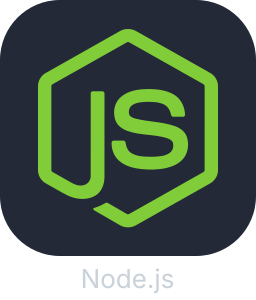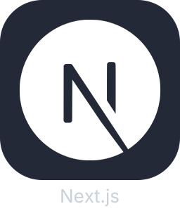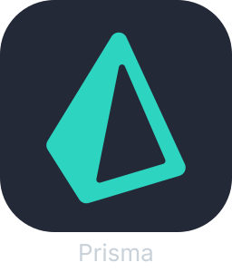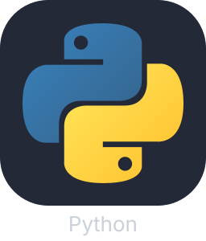

  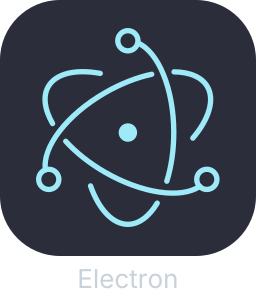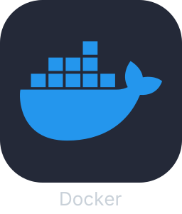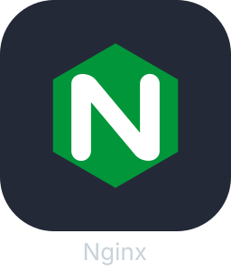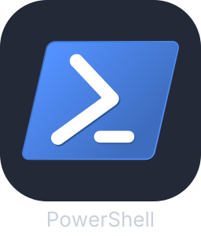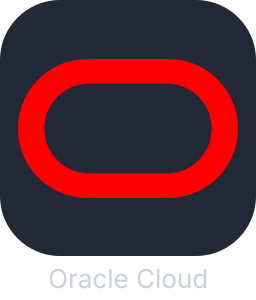

###

<h3 align="left">⚙️ OS & logiciels</h3>

  

  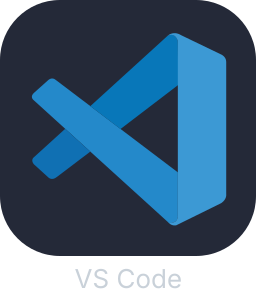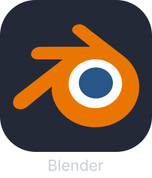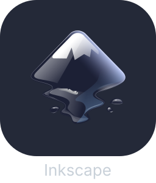

